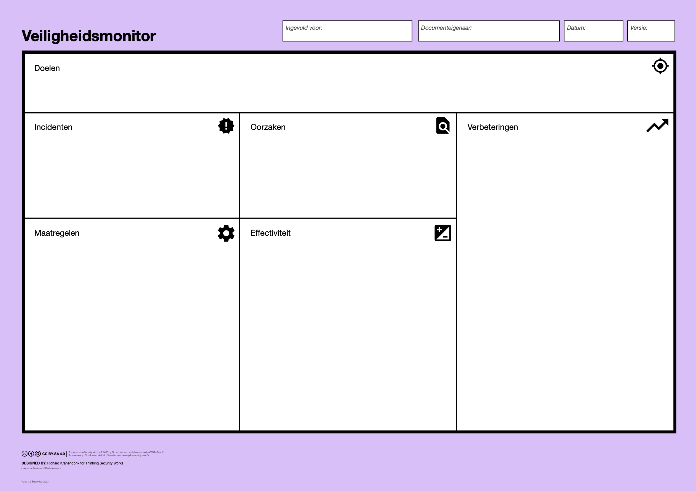

# Workshop 3: Effectiviteit

Deze workshop is typisch 3 maanden na de tweede workshop (Maatregelen).

De Workshop Facilitator bereidt, evt. met hulp van de Team Captain, de sessie voor:

* selecteren van relevante incidenten (uit het incidentenregister)
* gemaakte root cause analyses
* de eerder vastgestelde maatregelen
* resultaten van effectiviteitsmetingen.

De onderstaande onderwerpen worden behandeld met behulp van het Canvas.

<figure><figcaption></figcaption></figure>

### Incidenten en Oorzaken

Met het Team worden de incidenten uit de afgelopen periode besproken, en wordt de oorzaak van het incident vastgesteld.

### Evaluatie van de maatregelen

Van de maatregelen die geïmplementeerd zijn, worden de effectiviteitsmetingen besproken. Is het streefgetal behaald, of moet de maatregel worden uitgebreid of aangepast?

### Verbeteringen voor de volgende iteratie

Vanuit de incidenten, oorzaken en evaluatie van maatregelen wordt bepaald welke verbeteringen nodig of wenselijk zijn voor de volgende iteratie.

### Uitkomsten

Een verslag van de meeting en een lijst met verbeteringen voor de volgende iteratie.

### Verdieping

De achterkant van de **Policy Card** biedt ruimte voor gegevens over de effectiviteit van de maatregelen. Hierop worden genoteerd:

* het resultaat van de laatste effectiviteitsmeting
* door wie en wanneer de meting is uitgevoerd
* evt. een verwijzing naar meer gedetailleerde documentatie
* de uitkomsten van de evaluatie
* door wie de evaluatie is uitgevoerd
* bevindingen en aanbevelingen van de Risico-eigenaar.
